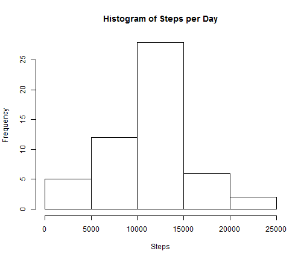
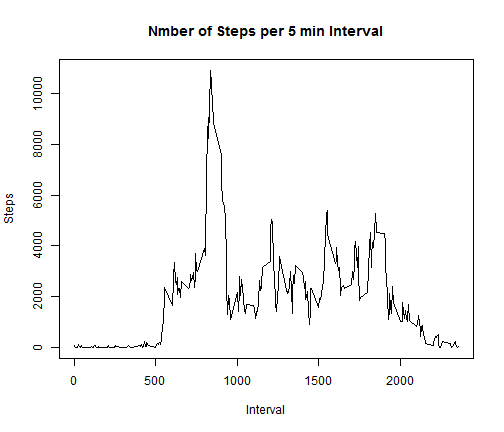
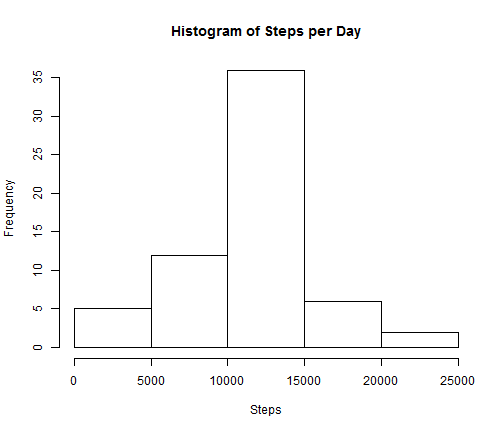

### Agenda

1. What is mean total number of steps taken per day
2. What is the average daily activity pattern
3. Imputing missing values

--- .class #id 

### Load required libraries


```r
library(reshape2)
library(lattice)
```

### Loading and preprocessing the data


```r
data <- read.csv("activity.csv", colClasses = c("numeric", "Date", "numeric"))
```


---

### What is mean total number of steps taken per day? 


```r
melted <- melt(data, id.vars="date", measure.var = "steps" )
totalSteps <- dcast(melted, date ~ variable, sum)

hist(totalSteps$steps, xlab= "Steps", main = paste("Histogram of" , "Steps per Day"))
```

 

#### Calculate and report the mean and median total number of steps taken per day

##### Mean

```r
meanSteps <- dcast(melted, date ~ variable, mean)
```

#### Median

```r
medianSteps <- dcast(melted, date ~ variable, median, fill=0)
```

---

### What is the average daily activity pattern?

```r
dataNoNA <- na.omit(data)
meltInterval <- melt(dataNoNA, id.vars="interval", measure.var = "steps" )
totalStepsInterval <- dcast(meltInterval, interval ~ variable, sum)
plot(totalStepsInterval$interval,totalStepsInterval$steps, type="l", xlab = "Interval", ylab = "Steps")
title(main = "Nmber of Steps per 5 min Interval")
```

 

---

### Question 3 - Imputing missing values

#### Poplulate the NA with the mean for that 5-minute interval


```r
sum(is.na(data$steps))
```

```
## [1] 2304
```

```r
for(i in 1:nrow(data)){
    temp <- 0
    if(is.na(data[i,1])){
        temp <- mean(subset(data, data$interval == data[i,3])[,1], na.rm=T)
        data[i,1] <- temp
    }
}
```

continue....

---

#### Histogram of the total number of steps taken each day

```r
meltedClean <- melt(data, id.vars="date", measure.var = "steps" )
totalStepsclean <- dcast(meltedClean, date ~ variable, sum)

hist(totalStepsclean$steps, xlab= "Steps", main = paste("Histogram of" , "Steps per Day"))
```

 

#### Mean

```r
meanStepsClean <- dcast(meltedClean, date ~ variable, mean)
```


#### Median

```r
medianStepsClean <- dcast(meltedClean, date ~ variable, median)
```

